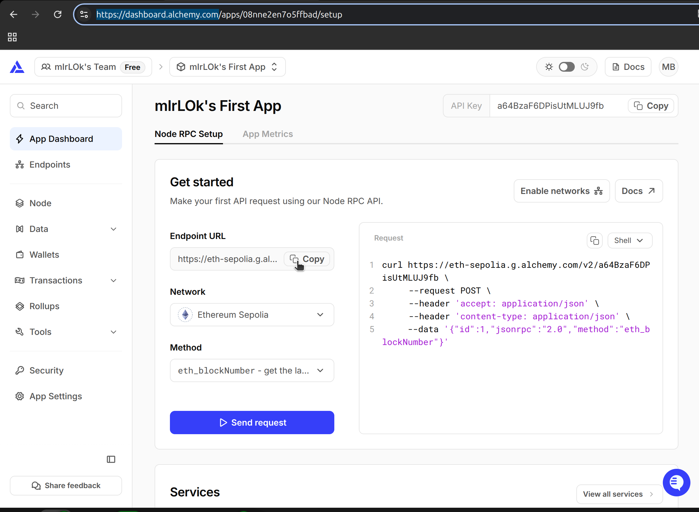
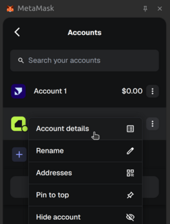
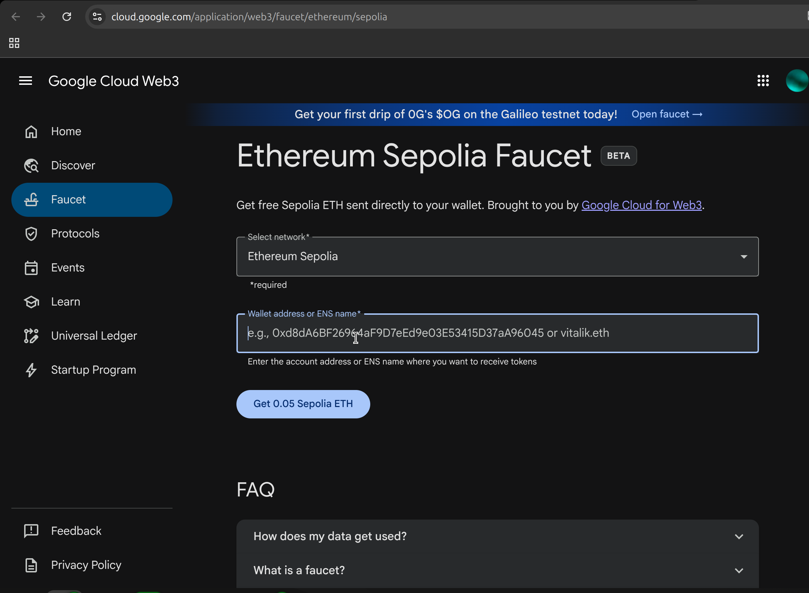
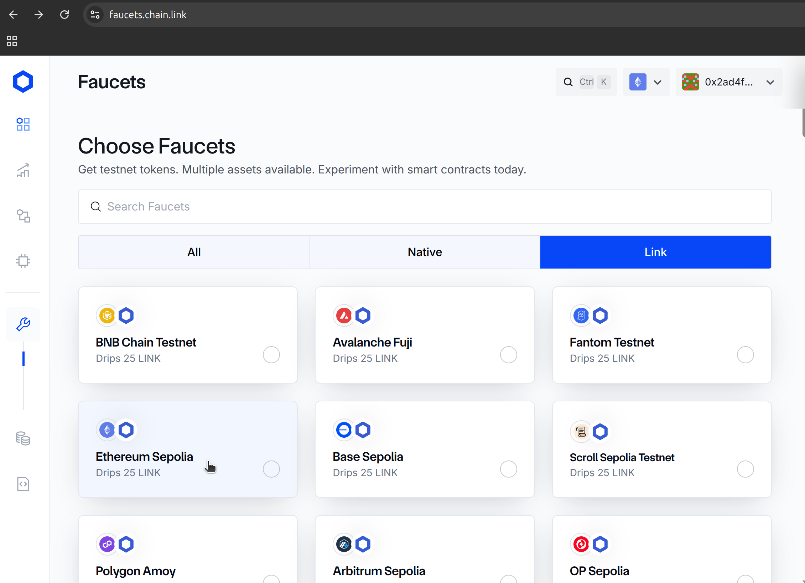
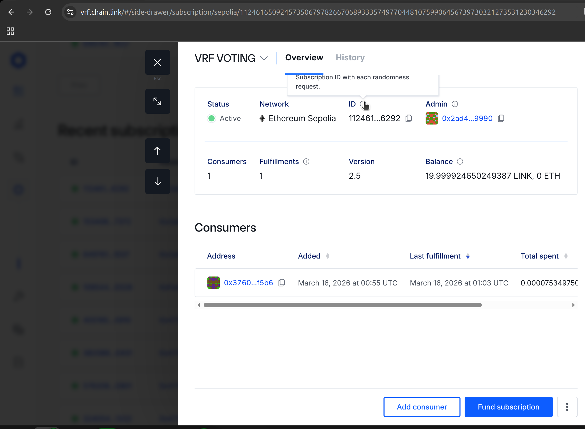
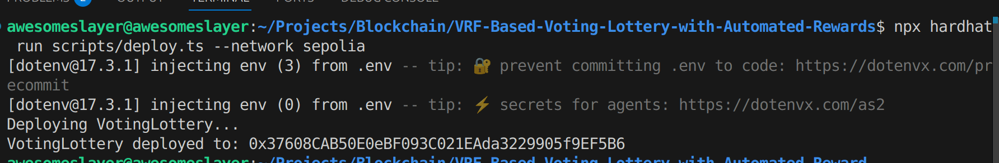
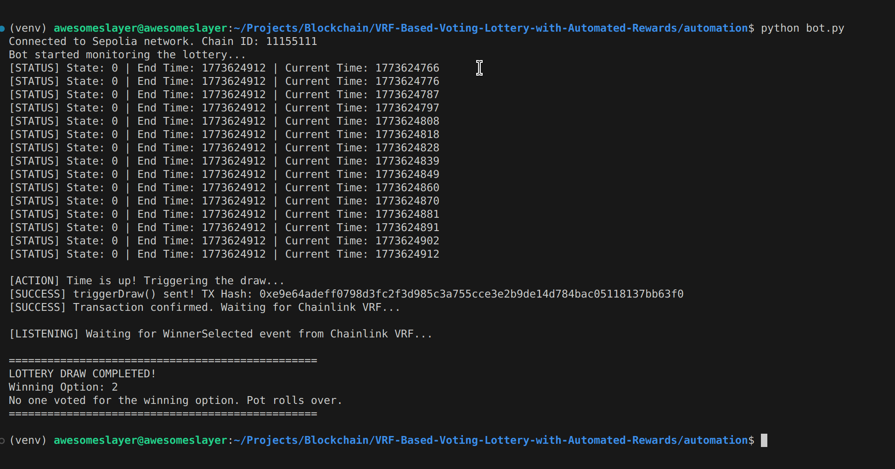

# VRF-Based Voting Lottery with Automated Rewards

This project implements a decentralized lottery system on the Ethereum Sepolia testnet. Participants enter the lottery by paying a fixed fee and voting for specific options. Once the predefined entry window closes, an off-chain Python automation script triggers the smart contract. The contract requests cryptographically secure randomness via Chainlink VRF v2.5 to select a winning option and a random winner among the voters, allocating the prize pool securely using a pull-over-push pattern.

---

## Project Architecture & Flow

1. **User Entry:** Users call `enterLottery(option)` sending 0.01 ETH.
2. **Monitoring:** A Python bot continuously checks the lottery deadline via Web3.py.
3. **Trigger:** Once the deadline passes, the bot executes `triggerDraw()`.
4. **VRF Request:** The smart contract halts entries and requests a random number from Chainlink VRF.
5. **Resolution:** Chainlink callbacks `fulfillRandomWords`, the contract computes the winner, updates balances, and emits the `WinnerSelected` event.
6. **Automation Complete:** The bot catches the event and logs the result. Winners can claim their rewards via `claimReward()`.

---

## Prerequisites

Before running this project, ensure you have the following installed:
- Node.js (v18 or higher)
- Python (v3.10 or higher)
- MetaMask extension (configured for the Sepolia testnet)

---

## Installation Guide

### Step 1: Clone the Repository
```bash
git clone git@github.com:awesomeslayer/VRF-Based-Voting-Lottery-with-Automated-Rewards.git
cd VRF-Based-Voting-Lottery-with-Automated-Rewards
```

### Step 2: Smart Contract Setup (Node.js)
Initialize the project and install strict versions of dependencies to prevent Hardhat v2/v3 and ESM/CommonJS conflicts.

```bash
npm init -y
# Ensure "type": "module" is NOT in your package.json. If it is, delete it.
npm install --save-dev hardhat@2.22.10 @nomicfoundation/hardhat-toolbox@5.0.0 @nomicfoundation/hardhat-ignition@0.15.5 @nomicfoundation/ignition-core@0.15.5 @chainlink/contracts@1.2.0 @openzeppelin/contracts@5.0.2 dotenv ts-node typescript @types/node@20 @types/mocha@10 @types/chai@4.3.16 ethers@6.13.2 --legacy-peer-deps
```

### Step 3: Automation Bot Setup (Python)
Navigate to the automation folder and set up a virtual environment.

```bash
cd automation
python3 -m venv venv
source venv/bin/activate  # On Windows use: venv\Scripts\activate
pip install web3==6.11.1 python-dotenv==1.0.0 setuptools==69.5.1
cd ..
```

---

## Configuration and Ecosystem Setup

### 1. Environment Variables
Create a `.env` file in the root directory:
```env
RPC_URL=""
PRIVATE_KEY=""
CONTRACT_ADDRESS=""

# Contract
NUM_OPTIONS="4"
SPLIT_AMONG_ALL="true"
ENTRY_FEE="0.001"
DURATION_MINUTES="5"
```

### 2. Acquiring API Keys and Testnet Funds
- **RPC URL:** Go to [Alchemy](https://www.alchemy.com/), create an app for Ethereum Sepolia, and copy the HTTPS RPC URL into `.env`.
  
  

- **Private Key:** Export your Sepolia private key from MetaMask and paste it into `.env` (without `0x`).

  

- **Testnet ETH:** Obtain Sepolia ETH from the [Google Web3 Faucet](https://cloud.google.com/application/web3/faucet/ethereum/sepolia).
  
  

- **Testnet LINK:** Obtain LINK tokens from the [Chainlink Faucet](https://faucets.chain.link/).
  
  

### 3. Setting Up Chainlink VRF
1. Go to the [Chainlink VRF Dashboard](https://vrf.chain.link/).
2. Click "Create Subscription", fund it with your testnet LINK tokens.
3. Note your `Subscription ID`.
  
  

---

## Compilation & Deployment

1. Open `scripts/deploy.ts` and replace the `subId` variable with your actual Subscription ID.
2. Compile the contracts:
   ```bash
   npx hardhat clean
   npx hardhat compile
   ```
3. Deploy to Sepolia:
   ```bash
   npx hardhat run scripts/deploy.ts --network sepolia
   ```
   
   

4. The deployed contract address will be automatically added to `CONTRACT_ADDRESS` in `.env`.
5. Verify your contract using:    
    ```bash
    bash verify.sh
    ```
6. **CRITICAL:** Return to the [Chainlink VRF Dashboard](https://vrf.chain.link/), open your subscription, click **"Add consumer"**, and paste your contract address.

---

## Running the Project

1. **Enter the Lottery (Optional):** You can enter the lottery by calling `enterLottery()` and sending entry fee (e.g. 0.01 ETH) via a custom script or Etherscan before the time expires.
2. **Start the Automation Bot:**
   ```bash
   cd automation
   source venv/bin/activate
   python bot.py
   ```

### Expected Bot Output

The bot will monitor the blockchain. Once the deadline passes, it will trigger the contract, wait for the VRF callback, and output the final result (winning option and the winner's address).



---

## Starting a New Lottery Round

By design, to ensure maximum security and prevent manipulation of past balances, this smart contract represents a **single-round lottery**. Once the draw is completed, the state permanently changes to `CLOSED`.

If you want to run a fresh lottery round for a new demonstration:
1. **Deploy a New Contract:** Run `npx hardhat run scripts/deploy.ts --network sepolia` again.
2. **Update `.env`:** Replace the `CONTRACT_ADDRESS` variable with the newly generated address.
3. **Authorize the New Contract:** Go to your Chainlink VRF Subscription dashboard and add the new contract address as a "Consumer".
4. **Run the Bot:** Restart `python bot.py` to monitor the new 5-minute round.

---

## Security & Architecture Considerations
- **Provable Fairness:** Using Chainlink VRF guarantees that the random number is generated off-chain with a cryptographic proof. It is mathematically impossible for miners or the developer to predict or manipulate the winning option.
- **Pull over Push:** The system uses the "Pull over Push" design pattern. Instead of sending ETH automatically (which exposes the contract to reentrancy attacks), the contract allocates the prize to a `claimableBalances` mapping. The winner must explicitly call `claimReward()` to retrieve their funds safely.
